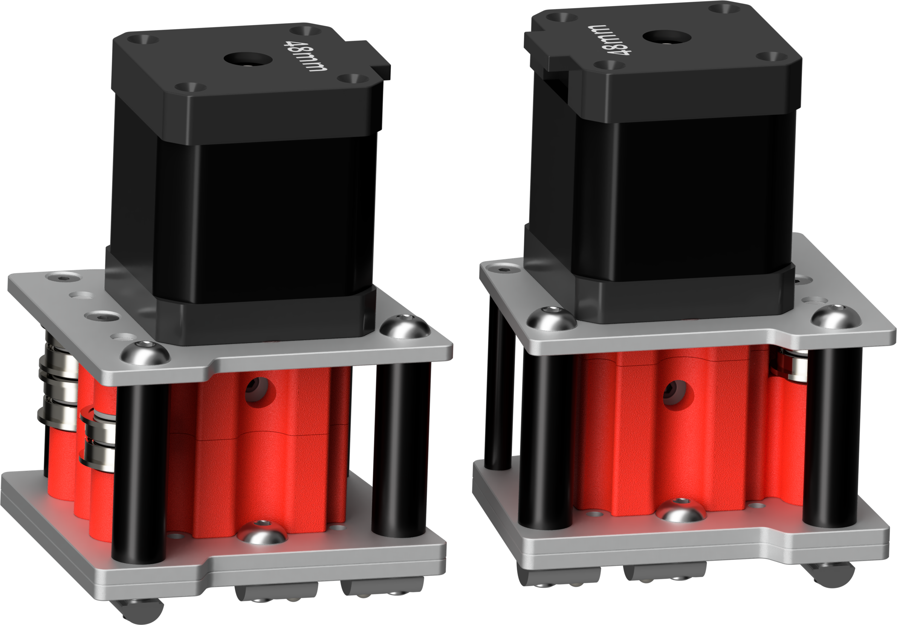

# Mercury One.1 - Metal Stepper Mounts
 Metal stepper mounts for the Mercury one.1

 These are a self source design using laser cut aluminum plates from vendors like sendcutsend. The imperial files are for .125 inch plate, and the metric files are for 3mm plate.

 The metric version is untested as I have only built these using .125 inch plate from sendcutsend. The metric version will also require M5 washers under the M5 bolts.

 The current pin hole is tight and may require a reamer. I have also hammered a dowel pin through each of the pin holes. Then chucked the pin into a cordless drill to open them up. The pins are designed to be a tight fit, so that the metal plates take all of the force from the belts rather than the printed inserts.

 The printed inserts do not provide any structual support. They are only there to set the belt height and act as a guide for the belts.

 
